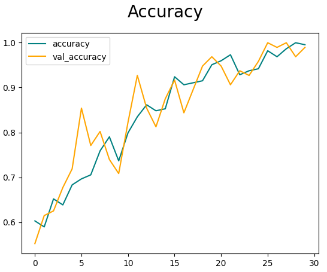
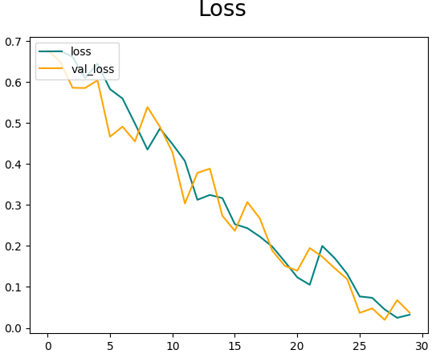
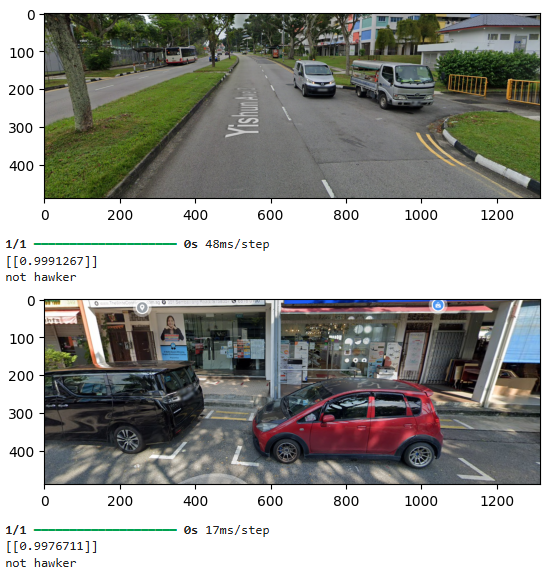
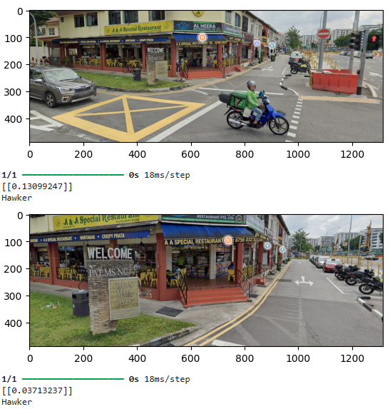
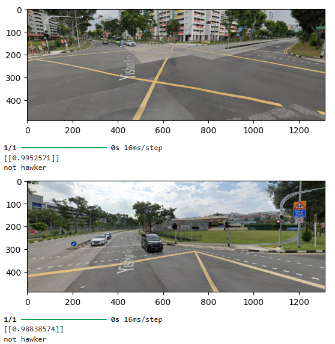
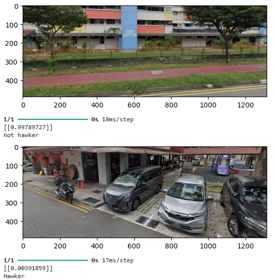
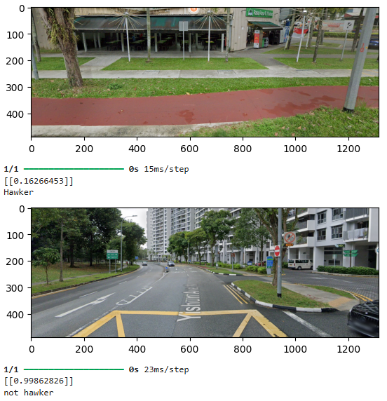

# AI Hawker Classification

A Sequential Convolutional Neural Network (CNN) that identifies Hawkers from google street images.

Uses Adam optimizer for weight updates and learning, and Conv2d for CNN layers.

## Libraries Used

#### Tensorflow
#### matplotlib
#### opencv-python
#### numpy

## Screenshots

Accuracy of model over training

Loss of model over training

Classification Results:

